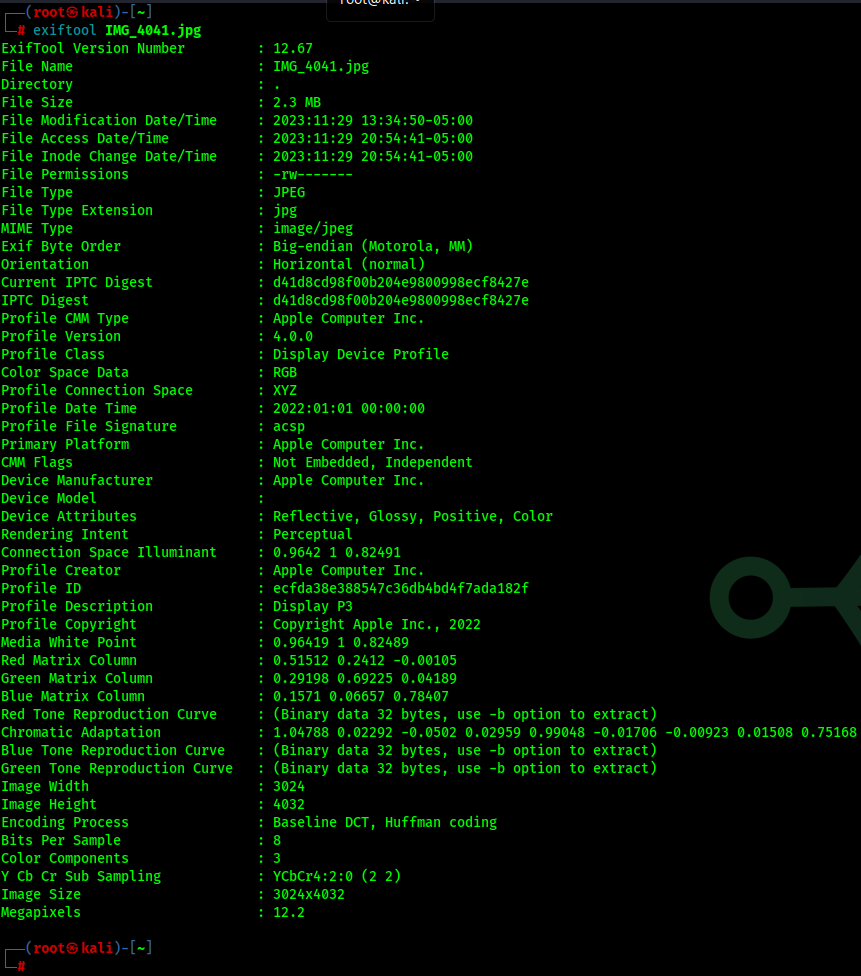

# BurpSuite

[BurpSuite](https://portswigger.net/burp) is industry standard tool for web application hacking, and is essential in any web pentest. Free community edition can be downloaded from [here](https://portswigger.net/burp/communitydownload).&#x20;

Plenty of good info and hands on from the [TryHackMe modules](https://tryhackme.com/module/learn-burp-suite).

\*Note: This section is currently still being updated.

## Setup

### Browser Setup

We can install [FoxyProxy](https://foxyproxy.com/) Standard to setup for easy proxy to pass traffic through Burpsuite.

* [Chrome](https://chrome.google.com/webstore/detail/foxyproxy-standard/gcknhkkoolaabfmlnjonogaaifnjlfnp)
* [Firefox](https://addons.mozilla.org/en-US/firefox/addon/foxyproxy-standard/)

With FoxyProxy installed we can right click on the extension > Options

&#x20;

.png>)

Add new Proxy

.png>)

From here, we add the IP to be our machine `127.0.0.1`, and the port to `8080`&#x20;

Then click on the General tab at the tab and give this a name, like Burp or Burpsuite or something.&#x20;

.png>)

Click Save and ta-da!

From here, when we want to use BurpSuite, we can click on the extension icon and select our Burp proxy

.png>)

## Usage

With our browser proxy setup, when we open Burpsuite we can choose a temporary project, or if we have the professional edition we can open exiting projects.

.png>)

When we're ready to start intercepting our traffic, we can go to the proxy tab, and turn on intercept.

**\*NOTE** - This will intercept ALL browser traffic. If we want to intercept only specific IPs or websites, we need to setup our scope.

### Scope

The scope will be sure to only intercept traffic to the specific IPs or websites. We can set our scope by Selecting Target > Scope

.png>)
